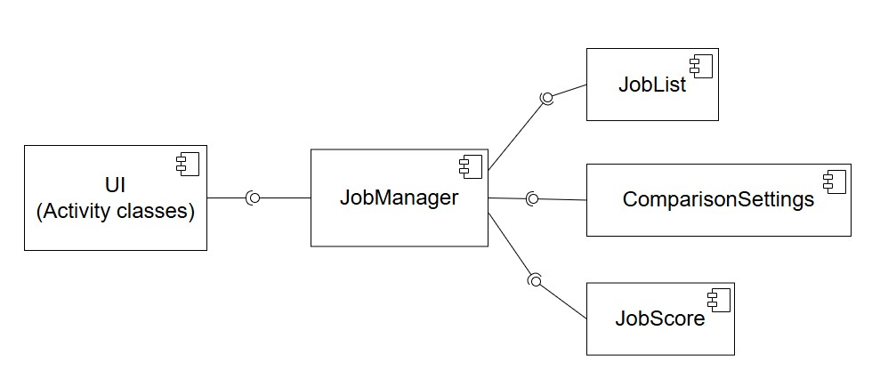
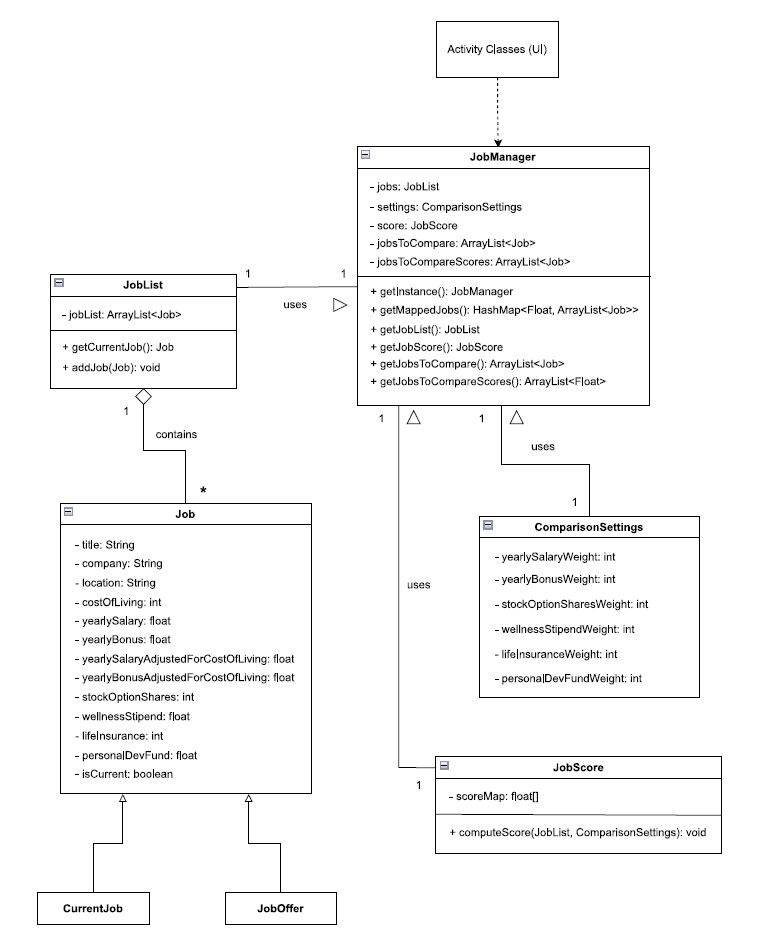
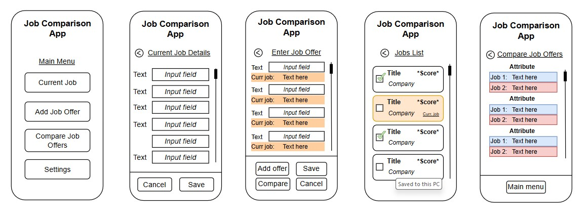

# Design Document

**Author**: Team 260

## 1 Design Considerations

### 1.1 Assumptions

The Job Comparison App is a simple front-end application that allows users to enter, manipulate and save the data in the app. The app will be developed for Android platform only, which means the implementation will be dependant on the Android environment with it's UI and functionality.   
While it's a good practice to implement the latest features provided by the framework, it has to be considered that there is a wide range of devices that use Android OS and many of them do not run the latest Android version. Therefore, the app should be developed using the Android SDK version that is compatible with the vast majority of the devices, so there will be minimal number of users who may have a bad experience with the app. In addition, the app would have to be maintained in the future to keep the bug fixes and security patches up to date.   

### 1.2 Constraints

The system design does not include record deletion functionality. In fact, if it's decided to include record deletion functionality in a later stage of the development process, the system will work inefficiently because of the current data structures implementation. In that case, it would require a re-design of some of it's main components.   
Another constraint could be that developing in Java may limit the app's features due to Kotlin being the officially recommended language for Android development. 

### 1.3 System Environment

The Job Comparison App is designed to work on mobile devices that use Android OS and to be downloaded through Google Play. However, its primary goal is to be compatible and have responsive UI for Google Pixel 9a smartphone.
#### - Hardware
While the app does not interact with the hardware layer directly and does it through OS, the various physical components will be involved, which include, but not limited to: CPU, GPU, RAM, Storage, Sensors (i.e. touchscreen), WiFi adapter, etc.

#### - Software
The system will be developed for Android environment meaning any device with Android OS should be capable of downloading it through Google Play. From the architectural perspective, the basic Android software layers with which the app will communicate directly and indirectly are:   
1. Application framework - To make API calls to various system services, like Window Manager, Resource Manager, Broadcast Receiver and others.         
2. Libraries - Android native libraries to handle graphics, input, sensors, etc. 
3. Android Runtime - Compiles and converts app's bytecode into machine instructions.
4. Linux Kernel - Memory management, process threading, etc.

## 2 Architectural Design  

### 2.1 Component Diagram

The system has the following components: 
1. UI - Activity classes, layouts and interactive elements within them (buttons, input fields, etc.)
2. JobManager - The component that orchestrates the storage collected data from the user and its manipulation. It provides the processed data to the UI.
3. JobList - Store and retrieves the Job object instances.
4. ComparisonSettings - Store the settings used to compare Job object instances.
5. JobScore - Compute score for Job instances based on the settings and stores the resulting scores.   
 

### 2.2 Deployment Diagram

Since its a simple front-end application with internal storage and no back-end, the deployment diagram is unnecessary. The only node in the deployment diagram would be the Android device, because the app is deployed on the device and runs within its runtime environment.

## 3 Low-Level Design

1. Activity classes (UI components) - there are several activity classes for each page (layout) mockup.   
2. JobManager class - the main class that orchestrates usage of the other classes and connects business logic with UI. It's initialized using singleton design pattern to make sure it's the only instance and to invoke it in any activity class.   
3. JobList - stores Job instances and provides methods for their addition and retreieval.  
4. Job - the class for job offers and current job (which is a variation of a job offer because it has the same attributes). 
5. ComparisonSettings - the class that stores settings used by the algorithm to rank jobs.  
6. JobScore - the class to compute and store job scores in the array. The array is used after sorting to map the scores to corresponding Job instances. 

### 3.1 Class Diagram

### 3.2 Other Diagrams

## 4 User Interface Design

