# **Test Plan**

**Author**: Team 260

## **1 Testing Strategy**

### **1.1 Overall strategy**

1. ***Unit Testing***  
   1. *Scope: Individual functions and classes, such as job data validation, score calculation, weight adjustment logic, and menu navigation helpers.*  
   2. *Activities: Write automated tests for each atomic unit; mock external dependencies.*  
   3. *Responsible: Hezhong Tao and Siddarth Pandian.*  
2. ***Integration Testing***  
   1. *Scope: Interactions between components, e.g., saving a job offer and retrieving it for comparison, applying weights to ranking, and ensuring the current job is included correctly.*  
   2. *Activities: Test data flow between modules. Verify that the comparison table shows correct adjusted values.*  
   3. *Responsible: Hezhong Tao and Siddarth Pandian*  
3. ***System Testing***  
   1. *Scope: End-to-end user scenarios covering all menu options and workflows.*  
   2. *Activities: Execute complete user journeys (e.g., enter current job → add offers → adjust weights → compare jobs → perform another comparison). Validate against requirements, including edge cases.*  
   3. *Responsible: Maxim Olatoye and Lin Yao.*  
4. ***Regression Testing***  
   1. *Scope: Re-verification after code changes.*  
   2. *Activities: Re-run all automated unit and integration tests; manually execute critical system test cases to ensure existing functionality remains intact.*  
   3. *Responsible: Maxim Olatoye and Lin Yao.*

### **1.2 Test Selection**

1. ***Black-Box Techniques***  
   1. *Equivalence Partitioning*  
      1. *Applied to input fields with defined ranges*  
      2. *Also for job titles, company names, locations*  
   2. *Boundary Value Analysis*  
      1. *Test boundaries of numeric fields.*  
   3. *Use Case Testing*  
      1. *Enter/edit current job (first time vs. edit)*  
      2. *Enter job offers (single, multiple, cancel, then compare)*  
      3. *Adjust weights (save vs. cancel)*  
      4. *Compare jobs (with/without current job, different numbers of offers, select two jobs, view comparison table, return to main menu).*  
2. ***White-Box Techniques***  
   1. *Unit Level*  
      1. *Statement and branch coverage for core functions (e.g., calculateScore(), adjustForCostOfLiving(), validateInput()).*  
      2. *Path coverage for complex logic.*  
   2. *Integration Level*  
      1. *Ensure all code paths that connect modules are exercised (e.g., data retrieval after save, weight application in ranking).*

### **1.3 Adequacy Criterion**

1. ***Unit Tests***  
   1. *Target: ≥90% statement coverage, ≥80% branch coverage for all critical modules.*  
2. ***Integration Tests***  
   1. *Ensure that all key integration points are covered by at least one test.*  
3. ***System Tests***  
   1. *Traceability matrix mapping each functional requirement to at least one system test case.*  
   2. *All main menu options and sub‑options must be exercised.*  
   3. *Edge cases must be included.*

### **1.4 Bug Tracking**

***Tool:** A simple issue tracker will be used.*  
***Process:***

* *Each bug or enhancement request is logged with:*  
  * *Title and description*  
  * *Steps to reproduce*  
  * *Expected vs. actual result*  
* *Bugs are assigned to a developer, and status is tracked.*  
* *Enhancements are reviewed and prioritised before implementation.*

### **1.5 Technology**

*JUnit and Selenium.*

## **2 Test Cases**

| ID | Purpose | Steps | Expected Result |
| :---- | :---- | :---- | :---- |
| 01 | Verify that a user can enter current job details and save them. | 1\. Start the app and select the option “Enter or edit current job details”. 2\. Fill in all fields with valid data 3\. Choose “Save”. | The job details are saved.  |
| 02 | Verify that a user can edit an existing current job. | 1\. From the main menu, select the option “Enter or edit current job details”. 2\. Modify some fields. 3\. Choose “Save”. | The updated details are saved. Returning to the main menu reflects changes in subsequent comparisons. |
| 03 | Verify that canceling the current job entry/edit discards any changes.  | 1\. From the main menu, select the option “Enter or edit current job details”. 2\. Modify some fields. 3\. Choose “Cancel”. | No changes are saved.  |
| 04 | Verify that a user can enter a job offer and save it | 1\. From the main menu, select the option “Enter job offers”. 2\. Fill in all fields with valid data. 3\. Choose “Save”. | The job offer is saved.  |
| 05 | Verify that canceling a job offer entry does not save the offer. | 1\. From the main menu, select the option “Enter job offers”. 2\. Enter details for a job offer. 3\. Choose “Cancel” instead of “Save”. | No new job offer is added.  |
| 06 | Verify that comparison settings can be adjusted and saved. | 1\. From the main menu, select the option “Adjust comparison settings”. 2\. Set weights to some values. 3\. Choose “Save”. | The new weights are stored.  |
| 07 | Verify that invalid weight values are rejected | 1\. From the main menu, select the option “Adjust comparison settings”. 2\. Attempt to set a weight to 10 or \-1. 3\. Try to save. | The app should display an error message. |
| 08 | Verify that the compare feature shows a correct comparison table with adjusted values and scores. | 1\. Ensure the current job exists. 2\. Enter at least two job offers. 3\. From the main menu, select the option “Compare job offers”. 4\. Choose two jobs from the ranked list. 5\. Trigger comparison | The comparison table displays both jobs with all fields as per requirement. |
| 09 | Verify that the ranked list of jobs is ordered from best to worst, including the current job | 1\. Set up the current job and five job offers with known scores. 2\. From the main menu, select the option  “Compare job offers”. 3\. Observe the list of job offers displayed. | The jobs are listed in descending order of job score. The current job is clearly indicated. |
| 10 | Verify that the compare option is disabled when no job offers have been entered | 1\. Start the app with no job offers entered. 2\. Check the main menu option “Compare job offers”. | The option should be greyed out. |

## **2 Initial Testing Results**
NOTE: This contains only partials results as the app is still a work in progress.

The following are a list of tests that currently produce the desired results

### Test ID 01
The current job details are saved successfully

Updated Status Pass (D4 on 03/15/2026) 
Previous Issue:Unable to input decimal numbers for Salary, Bonus, Wellness Stipend, and Personal Development Fund fields.
Fix Details: 
1 Modified input fields to accept floating-point numbers
2 Display format shows 2 decimal digits as per requirement
3 Tested with values: Salary 180000.50, Bonus 30000.75, Wellness 800.50, Dev Fund 4000.25

Expected Result: Job details saved with decimal values preserved and displayed with 2 decimal digits
Actual Result:All fields save correctly with 2-decimal format

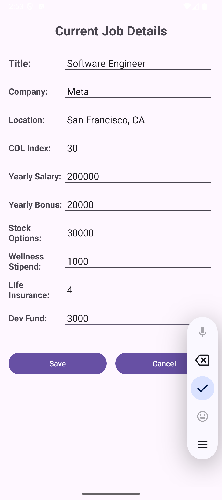
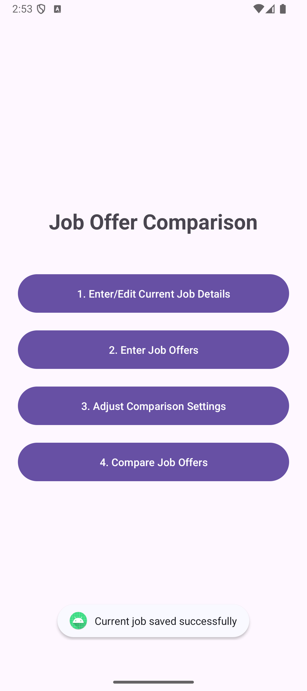

### Test ID 02
The edit functionality was tested by updating the salary from 200,000 to 300,000. The current job was successfully able to save the edit.
Updated Status Pass (D4 on 03/15/2026)  
Tested and changed to 280000.50 and passed. Floating requirement passed 

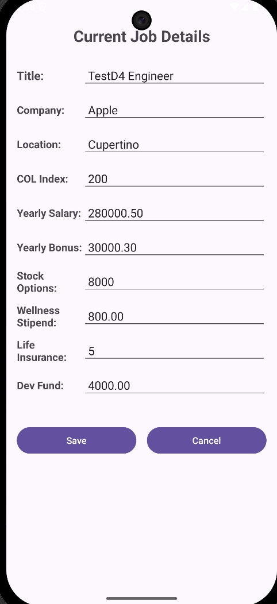

### Test ID 03
The cancel functionality is also working as expected. Any updates or edits to the Current job page is not being saved when cancelled.
Updated Status Pass (D4 on 03/15/2026)  
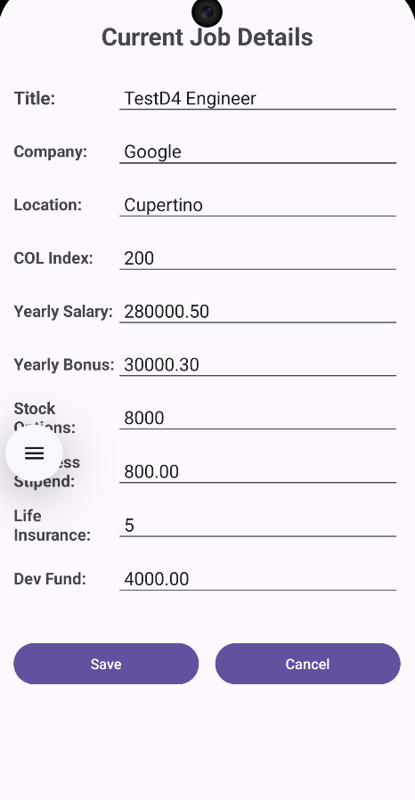

### Test ID 04
A job offer is also successfully able to be saved. It is saved in a job list that is persisted on a file.
** Updated Status:Pass (D4 on 03/08/2026)
Issue: Save Job Offers but did not persist to database 
Details: 
Steps executed:
  1. Click "Enter Job Offers"
  2. Fill all required fields:
     - Title: SWE
     - Company: Google
     - Location: MountainView
     - COL Index: 150
     - Yearly Salary: 150000
     - Yearly Bonus: 50000
     - Stock Options: 5000
     - Wellness Stipend: 500
     - Life Insurance: (% of salary 5%)
     - Dev Fund: (5000)
  3. Click "Save"
Expected Result: Jab Offers saved to database and shows in "Compare Job Offer"
Actual Result: Toast shows "saved successfully" but NO jobs are displayed in "Compare Job Offer"
Suspected issues: JobManager.addJob() not implemented or not being called; CurrentJobActivity/JobOfferActivity only create Job objects without database persistence; Database layer (DatabaseHelper) may be incomplete

Update: 
Status: passed 
- Date: 03/15/2026 (D4) 
- Notes: Fixed. Jobs now save to database and display in Compare Jobs list.
- tested: (1) Enter another offer, (2) Return to main menu, and (3) Compare with current job

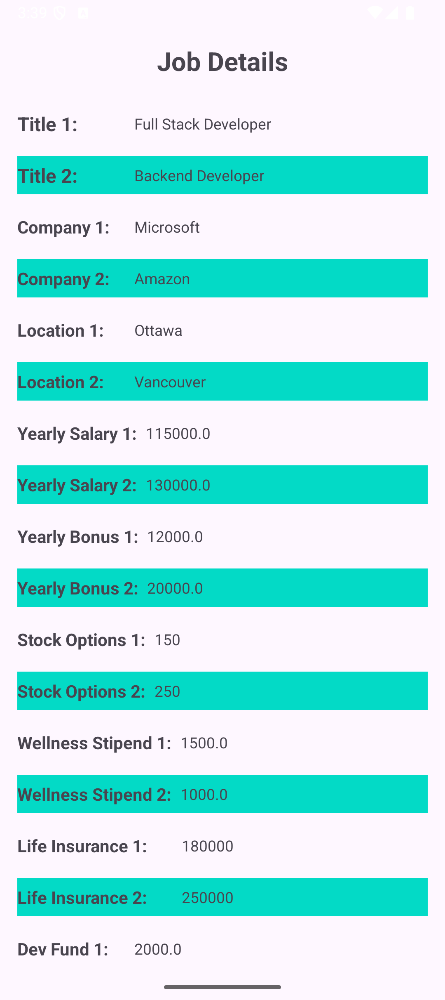
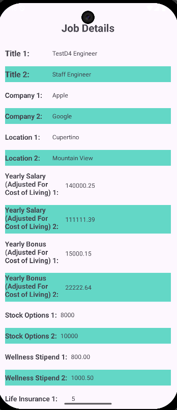

### Test ID 05

The cancel functionality is also working as expected. Any updates or edits to the Job Offer page is not being saved when cancelled.

Update D4: 
Status: passed 
- Date: 03/15/2026 (D4) 

### Test ID 06

Settings are also saved successfully and persisted.

Update D4: 
Status: passed 
- Date: 03/15/2026 (D4) 

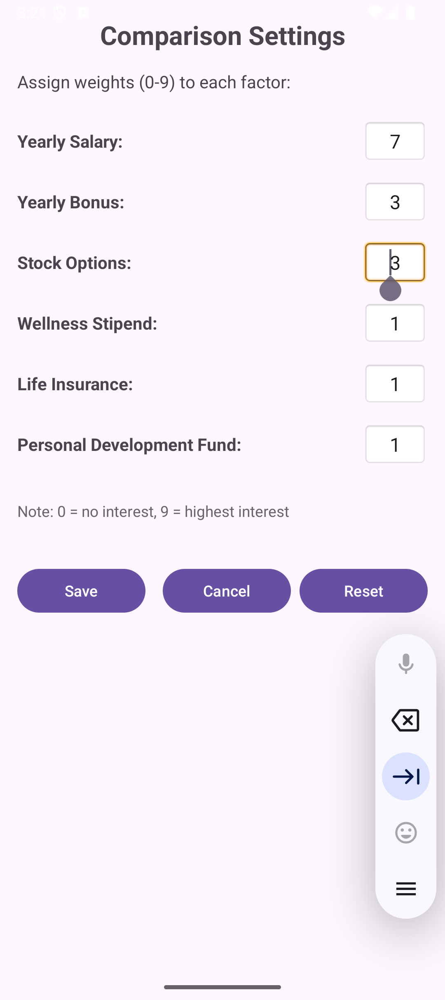
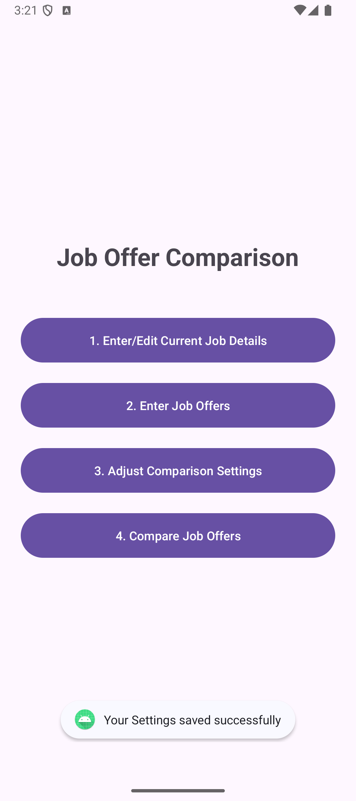

### Test ID 07
We added guards to the input box for the settings page such that is impossible to input an invalid number or character, therefore no error message is needed for an invalid input.

UpdateD4: 
Status: passed, tested with -1, 10, abc
- Date: 03/15/2026 (D4) 

### Test ID 08
Comparison results for top 2 job offers

UpdateD4: 
Status: passed
- Date: 03/15/2026 (D4) 

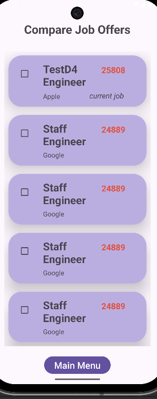
### Test ID 09 (Using Dummy Data)
The jobs are ranked from highest to lowest job scores. And current job is listed and annotated.

Update D4: from D3 dummy data → D4 SQLite
Status: passed
- Date: 03/15/2026 (D4) 

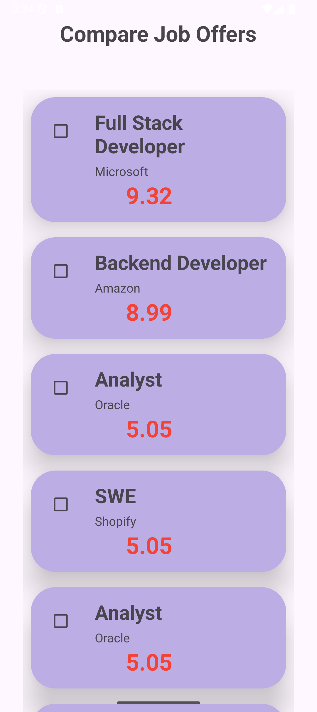
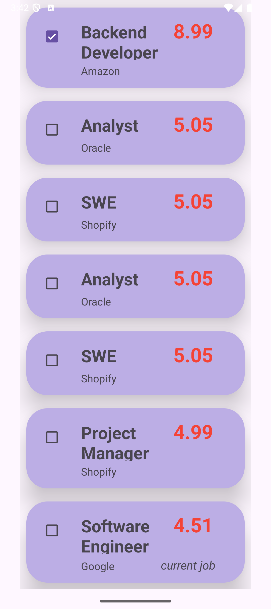

### Test ID 10
Comparison only takes place as soon as two job offers are selected. There is no compare button, as the app directly takes you to the comparison results once two jobs are selected

update D4:
Notes: Fixed CompareJobOffersActivity crash. Jobs display correctly with scores.
- Date: 03/15/2026 (D4) 

