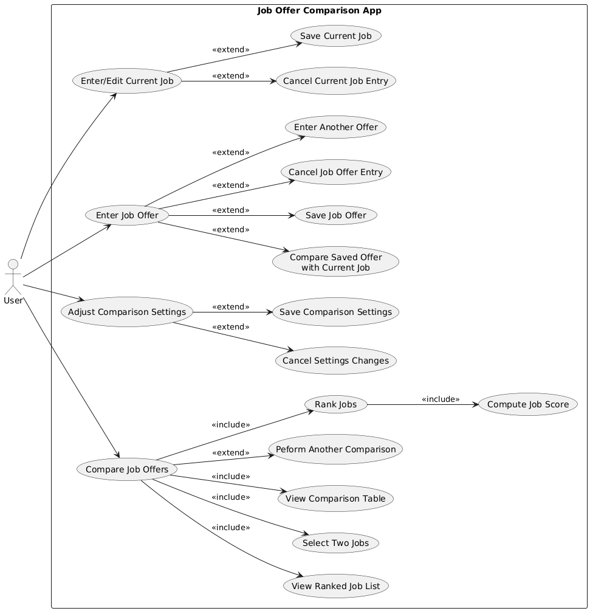

# Use Case Model

**Author:** Team 260

---

## 1. Use Case Diagram

The primary actor for this App is the **User**.

---

## 2. Use Case Descriptions
### 2.1 Enter / Edit Current Job

**Requirements**  
Allows the user to enter or update information for their current job.

**Pre-conditions**  
- The user selects the Current Job option

**Post-conditions**  
- The Current job information is either saved or cancelled.

**Main Scenario**
1. User selects “Enter / Edit Current Job.”
2. App displays current job form.
3. User enters or edits job information.
4. User chooses to save the job.

**Alternate Scenario**
- User cancels job entry and no changes are saved.

---

### 2.1.1 Save Current Job

**Requirements**  
Allows the user to save the entered or edited current job information.

**Pre-conditions**  
- User is entering or editing a current job.
- Required fields contain valid values.

**Post-conditions**  
- Current job data is stored.
- Job is marked as the current job.

**Main scenario**
1. User selects “Save” button
2. App saves the current job.
3. App returns to the main menu.

---

### 2.1.2 Cancel Current Job Entry

**Requirements**  
Allows the user to cancel entering or editing the current job.

**Pre-conditions**  
- User is entering or editing a current job.

**Post-conditions**  
- No changes are saved.

**Main scenario**
1. User selects “Cancel.” button
2. App discards entered data.
3. App returns to the main menu.

---

### 2.2 Enter Job Offer

**Requirements**  
Allows the user to enter details for a job offer.

**Pre-conditions**  
- User selects the Job Offer option.

**Post-conditions**  
- Job offer information is saved or discarded.

**Main Scenario**
1. User selects Enter Job Offer button on main menu
2. App displays job offer form.
3. User enters job offer details.
4. User chooses to save the offer.

**Alternate Scenario**
- User cancels job offer entry

---

### 2.2.1 Save Job Offer

**Requirements**  
Allows the user to save an entered job offer.

**Pre-conditions**  
- User is entering a job offer.
- Required fields contain valid values.

**Post-conditions**  
- Job offer is added to the job list.

**Scenarios**
1. User selects the Save button
2. App saves the job offer.
3. App updates the job list.

---

### 2.2.2 Cancel Job Offer Entry

**Requirements**  
Allows the user to cancel entering a job offer.

**Pre-conditions**  
- User is entering a job offer.

**Post-conditions**  
- Job offer is not saved.

**Scenarios**
1. User selects the Cancel option
2. App discards entered data.
3. App returns to the main menu.

---

### 2.3 Adjust Comparison Settings

**Requirements**  
Allows the user to adjust weight values used when comparing jobs.

**Pre-conditions**  
- User selects the Settings option.

**Post-conditions**  
- Comparison settings are saved or unchanged.

**Main Scenario**
1. User selects "Adjust Comparison Settings.” button on the main menu
2. App displays adjustable weight fields.
3. User modifies to desired weights.
4. User chooses to save settings.

**Alternate Scenario**
- User cancels changes.

---

### 2.3.1 Save Comparison Settings

**Requirements**  
Allows the user to save modified comparison settings.

**Pre-conditions**  
- User is adjusting comparison settings.

**Post-conditions**  
- Updated settings are stored.

**Scenarios**
1. User selects “Save.” button
2. App validates weight values.
3. App saves comparison settings.

---

### 2.3.2 Cancel Comparison Settings Changes

**Requirements**  
Allows the user to cancel changes to comparison settings.

**Pre-conditions**  
- User is adjusting comparison settings.

**Post-conditions**  
- Previous settings remain unchanged.

**Scenarios**
1. User selects the “Cancel.” button
2. App discards changes.

---

### 2.4 Compare Job Offers

**Requirements**  
Allows the user to compare jobs using weighted scoring.

**Pre-conditions**  
- At least two job offers exist, OR  
- At least one job offer and a current job exist.

**Post-conditions**  
- Jobs get ranked.
- Comparison results are displayed.

**Main Scenario**
1. User selects “Compare Job Offers.”
2. App computes job scores.
3. App ranks jobs.
4. App displays ranked job list.
5. User selects two jobs.
6. App displays comparison table.

**Exceptional Scenario**
- If insufficient job data exists, the App prevents comparison and notifies the user.

---

### 2.4.1 Compute Job Score

**Requirements**  
Calculates a numerical score for each job based on comparison settings.

**Pre-conditions**  
- Job data exists.
- Comparison settings are defined.

**Post-conditions**  
- Job scores are computed.

**Scenarios**
1. App retrieves job data.
2. App applies weight values.
3. Job scores get calculated.

---

### 2.4.2 Rank Jobs

**Requirements**  
Ranks jobs based on computed scores.

**Pre-conditions**  
- Job scores have been computed.

**Post-conditions**  
- Jobs are ordered by score.

**Scenarios**
1. App retrieves job scores.
2. App sorts jobs by score.
3. App outputs ranked job list.

---

### 2.4.3 Do Another Comparison

**Requirements**  
Allows the user to perform another comparison.

**Pre-conditions**  
- A comparison has already been completed.

**Post-conditions**  
- Another comparison is initiated.

**Scenarios**
1. User selects “Do Another Comparison.”
2. App displays ranked job list.
3. User selects two jobs.
4. App displays comparison table again.

---